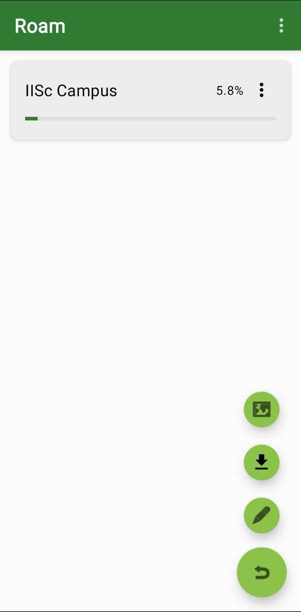
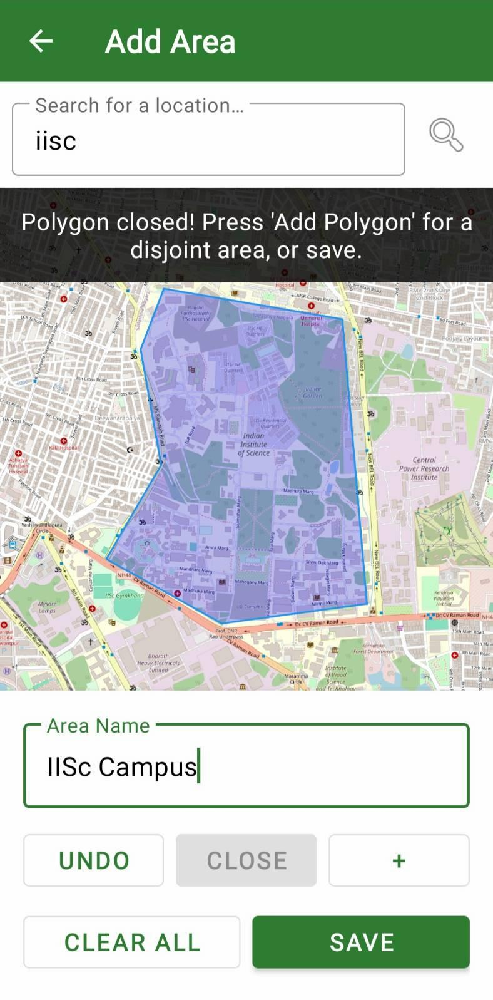
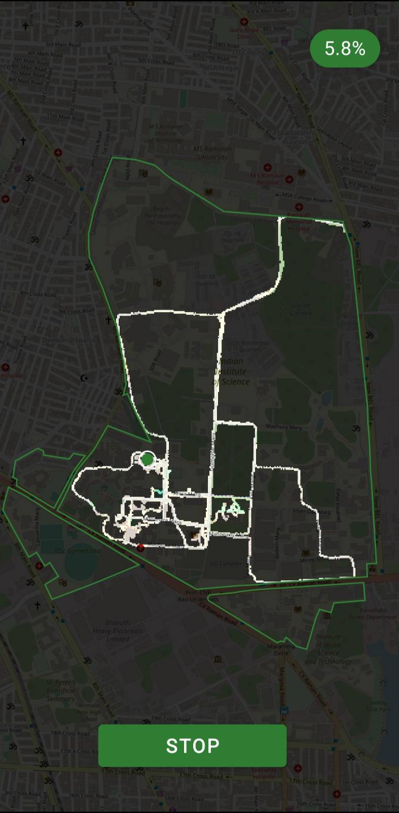

# 🧭 Roam

### Explore your area. Track your progress. Roam more.

Turn exploration into a game. Draw an area on the map, walk around, and watch the fog clear in real time as you discover new places.

---

## What is Roam?

I created Roam to track my progress as I explored my university campus one last time before graduating, gamifying the experience and motivating myself to explore more every day. Since no existing app did just this, I *vibe-coded* Roam to fill that gap.

Roam turns any area into an exploration challenge. Draw boundaries, set your difficulty, and start walking. The app tracks where you've been with a dark overlay that clears as you explore. Roam also shows you the percentage of your selected area that has been explored.

| Main Dashboard | Area Creation | Active Exploration |
|:---:|:---:|:---:|
|  |  |  |

---

## Getting Started

1. **Download** the latest APK from the [Nightly Build](https://nightly.link/mrigankpawagi/Roam/workflows/build.yml/main/Roam-release-APK.zip).
2. **Install** it on your Android device (you may need to allow installation from unknown sources).
3. **Create an area** by tapping the **+** button and drawing boundaries on the map. Alternatively, you can start with an preset area (like "IISc Campus") from the library, or import an area shared by someone else as a JSON file.
4. **Start exploring** by opening your area and pressing **Start**

That's it! Walk around and watch your progress grow.

---

## 🤝 Contributing

Issues with ideas, bug reports, or other questions are welcome! Feel free to open PRs if you'd like to contribute. You can also reach out to me to share feedback.
