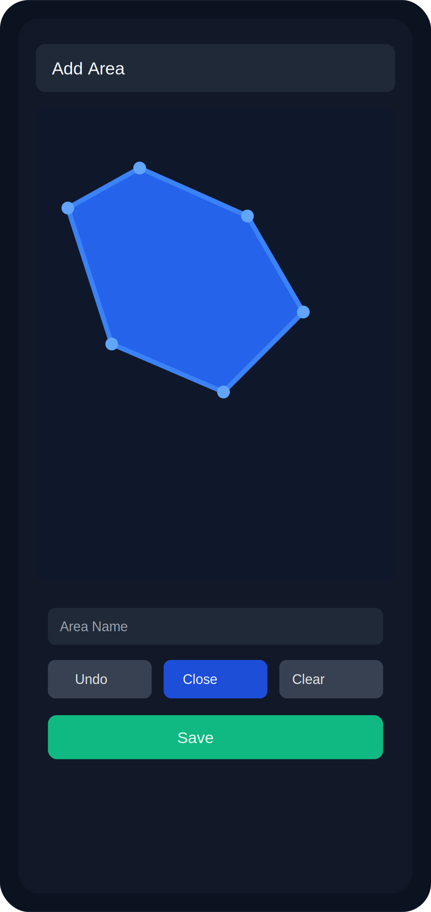
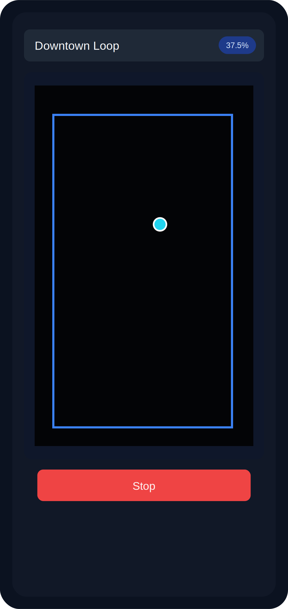
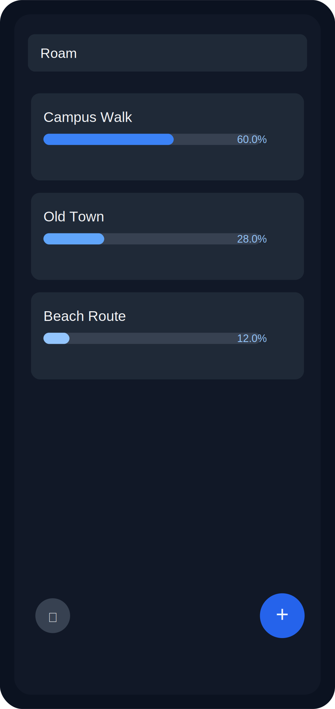

# 🧭 Roam

### Turn your city into a real-world exploration game.

Track where you've walked, reveal the map as you go, and challenge friends to explore more.

---

## ✨ What is Roam?

**Roam** helps you rediscover your surroundings by turning exploration into progress.

- Create custom exploration areas by drawing one or more polygons on the map
- Start tracking and reveal a fog-of-war overlay as you move
- See your exploration percentage in real time
- Tune exploration radius to adjust difficulty
- Import/export areas (with or without progress) and share them

---

## 📸 Screenshots

<table>
  <tr>
    <td align="center"><b>Area Setup</b></td>
    <td align="center"><b>Live Exploration</b></td>
    <td align="center"><b>Area Dashboard</b></td>
  </tr>
  <tr>
    <td></td>
    <td></td>
    <td></td>
  </tr>
</table>

> These are visual previews for the current app flow. If you want, we can replace them with real device screenshots in a follow-up.

---

## 🚀 Quick Start

1. Download the latest APK: **[Nightly Build](https://nightly.link/mrigankpawagi/Roam/workflows/build.yml/main/Roam-release-APK.zip)**
2. Install it on an Android device (allow install from unknown sources if prompted)
3. Open Roam and tap **+** to create an area
4. Draw your polygon(s), name your area, and save
5. Open the area and hit **Start** to begin tracking exploration

---

## 🧩 Core Experience

### 1) Define your area
Search any location, tap to place vertices, and close polygons.

### 2) Start roaming
Roam tracks your movement and marks nearby cells as explored.

### 3) Reveal your progress
Watch the fog clear in real time and push your percentage higher.

### 4) Share challenges
Export areas and send them to friends so everyone can compare progress.

---

## 🛠️ Built With

- Kotlin + Android SDK
- osmdroid + OpenStreetMap tiles
- Room (local persistence)
- Lifecycle ViewModel / LiveData

---

## 🤝 Contributing

PRs and ideas are welcome. If you try Roam with friends, feel free to share feedback and feature ideas!

---

### 🌍 Explore more. Reveal more. Roam more.

